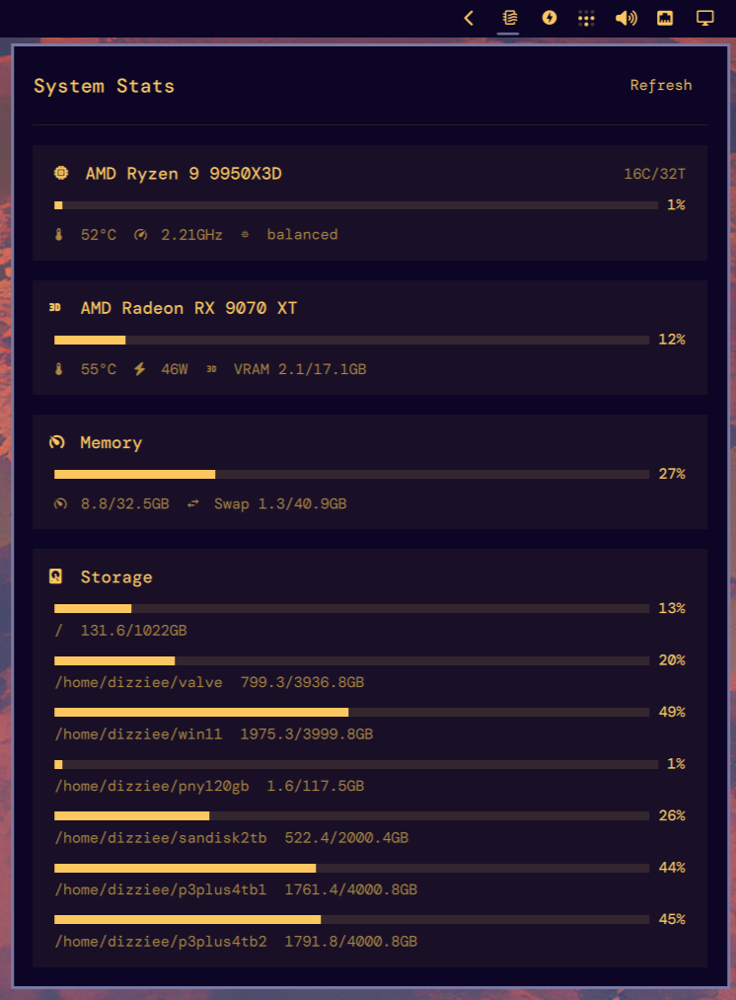

# dizziee.system-stats

CPU, GPU, memory, and storage monitor for the Omarchy bar. Displays real-time usage with per-compartment toggles and configurable poll intervals.

## Requirements

- Python 3
- `lspci` (for GPU name detection)

## Installation

```sh
omarchy plugin add https://github.com/JJDizz1L/dizziee.system-stats.git --enable
```

### Then place it in your bar layout with 
`omarchy bar plugin add dizziee.system-stats [--section <left|center|right>]`</br>

Suggested placement: 
```
omarchy bar plugin add dizziee.system-stats --section right
```

You can validate the plugin at any time with:

```sh
omarchy plugin validate ~/.config/omarchy/plugins/dizziee.system-stats
```

## Configuration
Configuration lives in `~/.config/omarchy/shell.json`.

| Key | Type | Default | Description |
|---|---|---|---|
| `compartments.cpu.enabled` | boolean | true | Show CPU usage |
| `compartments.cpu.pollIntervalSec` | integer | 30 | CPU poll interval |
| `compartments.gpu.enabled` | boolean | false | Show GPU usage |
| `compartments.gpu.pollIntervalSec` | integer | 30 | GPU poll interval |
| `compartments.memory.enabled` | boolean | true | Show memory usage |
| `compartments.memory.pollIntervalSec` | integer | 30 | Memory poll interval |
| `compartments.storage.enabled` | boolean | true | Show storage usage |
| `compartments.storage.pollIntervalSec` | integer | 30 | Storage poll interval |

## Preview



## Uninstall

```sh
omarchy plugin remove dizziee.system-stats
```

## License

MIT
