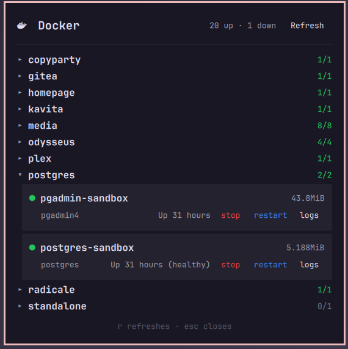
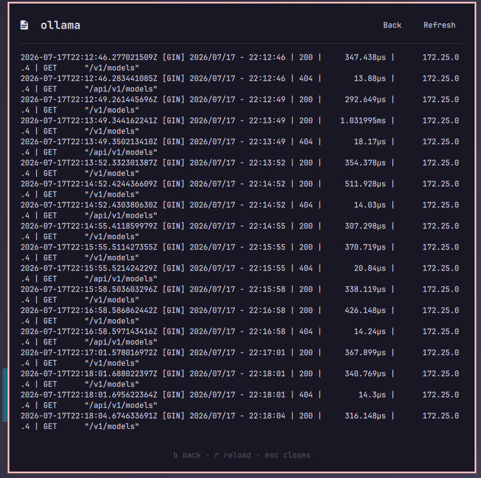

# Docker Monitor

An Omarchy Quattro bar widget for monitoring Docker containers.



## Features

- **Compose project grouping** — containers are organized by their Docker Compose project with collapsible headers
- **Live stats** — CPU and memory usage for each running container
- **Container actions** — start, stop, restart, and unpause containers directly from the panel
- **Log viewer** — view recent container logs with timestamps
- **Desktop notifications** — alerts when containers stop, become unhealthy, or start back up
- **Configurable polling** — adjustable refresh interval (default 10s)

### Log Viewer



## Install

```bash
omarchy plugin add https://github.com/djjeane/omarchy-docker-plugin.git
```

## Remove

```bash
omarchy plugin remove djjeane.docker-monitor
```

## Configuration

Available settings in `shell.json`:

| Setting | Type | Default | Description |
|---------|------|---------|-------------|
| `pollIntervalSec` | integer | 10 | Seconds between data refreshes (5–300) |
| `showStoppedContainers` | boolean | true | Show stopped/exited containers |
| `notificationsEnabled` | boolean | true | Desktop notifications on state changes |
| `logLines` | integer | 100 | Number of log lines to display (25–500) |

Example bar layout entry:

```json
{
  "id": "djjeane.docker-monitor",
  "pollIntervalSec": 15,
  "notificationsEnabled": true
}
```

## Keyboard shortcuts

| Key | List view | Log view |
|-----|-----------|----------|
| `r` | Refresh containers | Reload logs |
| `b` | — | Back to list |
| `esc` | Close panel | Back to list |

## IPC

```bash
omarchy-shell shell toggle djjeane.docker-monitor
omarchy-shell shell summon djjeane.docker-monitor
omarchy-shell shell hide djjeane.docker-monitor
```

## License

MIT

## Requirements

- Docker CLI (`docker`) accessible to the current user
- Python 3 (for the data collection script)
- `notify-send` (for desktop notifications)
