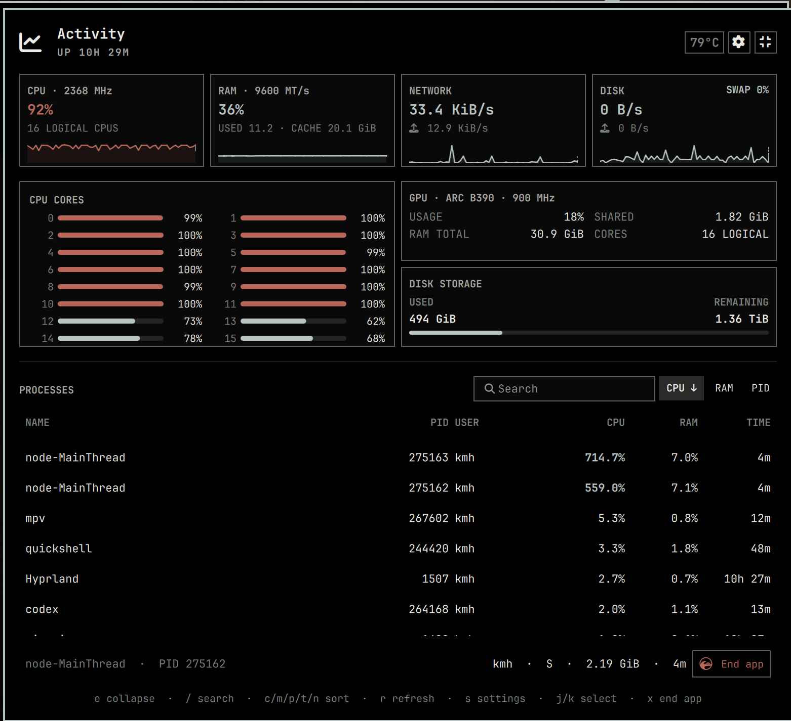

# Activity Monitor

Third-party Omarchy bar plugin for a fast system overview and an expandable
process monitor. It is self-contained under the user plugin directory, so
normal packaged Quattro updates do not replace it.



## Install

```bash
omarchy plugin add https://github.com/stappmus/omarchy-activity-monitor.git --enable
```

Enable or disable it through `Setup > Plugins`, or use:

```bash
omarchy plugin enable stappmus.activity-monitor
omarchy plugin disable stappmus.activity-monitor
```

The compact panel shows CPU, memory, network and disk activity plus the three
busiest processes. CPU and RAM card headings include the current average CPU
clock and configured DDR transfer rate. Expand it with the button or `e` for
per-core activity, memory and reclaimable cache, a swap badge in the disk
activity card, disk storage used and remaining, GPU utilization, graphics
clock and memory, search, process sorting, estimated CPU-package watts, and a
larger process list. Your own apps can be asked to close from the expanded
view after a confirmation.

CPU and GPU clocks are shown in MHz. DDR memory is shown in MT/s because DDR
transfers data twice per clock cycle; its marketed speed is a transfer rate,
not a clock frequency. A GPU clock reported as zero while the graphics engine
is fully power-gated is shown as `IDLE`, and measurements that the kernel or
firmware does not expose are omitted instead of estimated.

The `RAM USAGE` card shows used memory and cache together. Used memory follows
Linux's available-memory accounting: `(MemTotal - MemAvailable) / MemTotal`.
Cache is `Cached + SReclaimable`, matching `free`'s cache column. Linux can
reuse that cache automatically when applications need RAM, so it is not an
extra amount to add to used memory.

The gear button (or `s`) opens settings inside the panel. Preferences are
applied immediately and saved with the bar layout: update speed, graph history,
Celsius or Fahrenheit, hardware-speed labels, the default compact/detailed
view, and per-process power estimation. `Efficient`, `Balanced`, and `Fast`
sample core resources every 3 seconds, 1.5 seconds, and 0.75 seconds
respectively; slower-changing process, GPU, thermal, and storage readings use
proportionate cadences.

The `GPU` square lists up to two adapters separately. NVIDIA and discrete AMD
cards show used/total VRAM when their drivers expose it. Integrated GPUs show
`SHARED`: the reported system-memory allocation currently resident for
readable desktop GPU clients. Shared GPU memory is part of RAM and grows
dynamically, so the panel deliberately shows the amount in use without
inventing a fixed GPU memory total. Intel/Xe and compatible drivers use
standard DRM client counters; AMD uses its kernel busy/VRAM counters, and
NVIDIA uses NVML from the installed driver. Missing measurements remain visibly
unavailable.

The expanded CPU card shows the measured total CPU-package watts. Individual
process rows show their estimated share of that total.

Keyboard shortcuts in the expanded view:

- `j` / `k`: select a process
- `/`: search
- `c` / `m` / `w` / `p` / `t` / `n`: sort by CPU, memory, estimated watts,
  PID, runtime, or name
- `h` / `l`: cycle sort columns
- `r`: refresh
- `s`: open settings
- `x`: confirm closing the explicitly selected app
- `e` or `Esc`: collapse

The widget keeps one stdin-driven native stats reader alive only while its
panel is open. Resource, process, temperature, GPU, and storage requests retain
their independent refresh cadences without repeatedly launching collectors.
One single-shot deadline scheduler coalesces due work instead of maintaining a
recurring UI timer per metric. GPU sampling runs only while the advanced view
is expanded, and energy sampling additionally respects its settings toggle.
Closing the panel stops all readers but retains the last valid display values;
reopening shows those immediately while fresh counter baselines are collected
over 300 ms.

The native reader accesses procfs and sysfs directly and launches no child
collectors. It caches static CPU, disk, thermal, GPU, user, and process identity
metadata. Current process counters are still read on every process sample, but
the expensive scan for DRM client file descriptors runs only every ten seconds
and already-discovered GPU counters continue updating between scans. NVIDIA's
management library is loaded once per panel session rather than starting
`nvidia-smi` for every sample. No monitoring daemon runs while the panel is
closed.

App actions use a PID file descriptor plus the sampled process start time,
resolve worker processes to a verified same-user app ancestor, reject foreign
and protected processes, and never invoke a shell or privilege prompt. The
confirmation discloses that an app still running after a three-second graceful
close window will be force-closed.

`EST. W` is an interval estimate (three seconds in Balanced mode): measured
RAPL CPU package energy is assigned by each process's CPU-time share. It is
intentionally marked with `~` because Linux exposes energy for hardware
domains, not individual processes. Package coverage is processor-specific and
can include cores, uncore, integrated graphics, and on-chip interfaces; it does
not represent wall, display, storage, network, or audio power. Energy sampling
runs only while the advanced view is expanded. The plugin reads RAPL directly
when the kernel exposes it to the user. On systems where RAPL is root-only, an
optional root-owned companion helper may be installed; the plugin never opens
a privilege prompt while sampling. Unsupported hardware or an unavailable
reader shows `—`. Turning off process power estimates removes the column and
stops the energy reader entirely.

### Optional root-only RAPL reader

The base plugin needs no package or elevated access. If your kernel exposes
RAPL energy counters only to root, build the optional helper package:

```bash
git clone https://github.com/stappmus/omarchy-activity-monitor.git
cd omarchy-activity-monitor
makepkg --cleanbuild --install
```

That package compiles and installs one immutable native collector copy plus one
narrow sudoers rule which permits only its power-reader mode. The panel uses
`sudo -n`, so it never opens a password prompt. Remove it independently with:

```bash
sudo pacman -Rns omarchy-activity-monitor-power-helper
```

## Structure

- `Panel.qml` owns layout, keyboard/pointer interaction, selection, and sorting.
- `ActivityController.qml` owns reader processes, framing, the coalesced
  deadline scheduler, watchdogs, fresh-baseline handling, derived samples, and
  the explicit user/root power-reader state.
- `ProcessActionController.qml` owns confirmation state and guarded helper
  execution for app actions.
- `Model.js` contains snapshot factories, parsers, calculations, formatting,
  sorting, and side-effect-free UI policy helpers.
- `activity-sampler.cpp` is the unified native Linux collector; the checked-in
  `activity-sampler` executable is reproducibly built from it with `make` for
  Omarchy's x86-64 platform.

Resource, thermal, GPU, storage, package-energy, and derived-metric models
remain separate rather than being merged into a catch-all snapshot. The QML
action policy only provides immediate feedback; the plugin-local signal helper
always revalidates live procfs identity, ownership, state, and protection
before it signals anything. All helpers live at the plugin root and are
addressed by absolute plugin-relative paths, avoiding dependence on Omarchy's
packaged command tree.

## Remove

```bash
omarchy plugin remove stappmus.activity-monitor
```

## Test

```bash
make -B activity-sampler
./test/all.sh
qmllint -I /usr/share/omarchy/shell ActivityController.qml Panel.qml ProcessActionController.qml Sparkline.qml
omarchy plugin validate .
makepkg --verifysource
```

Licensed under the MIT License. The panel began as an Omarchy activity-panel
implementation and is maintained as an independent plugin by Kristoffer
Haugland.
